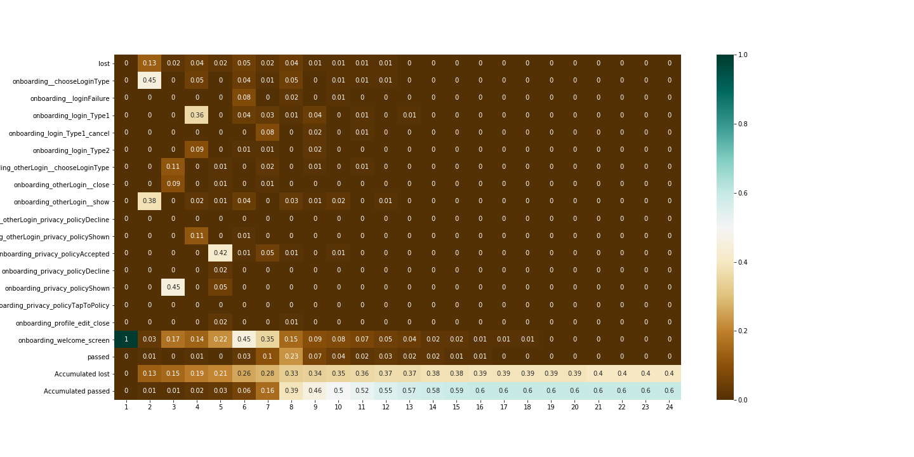
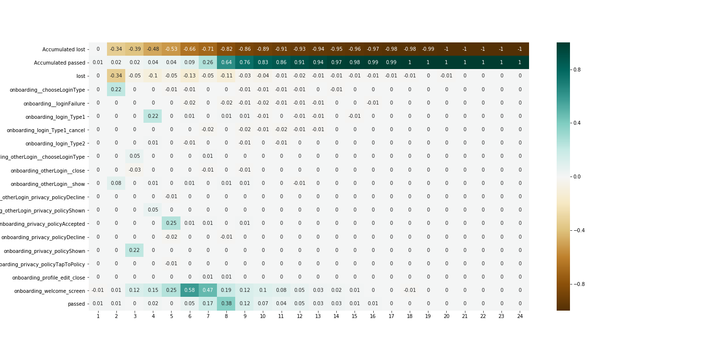
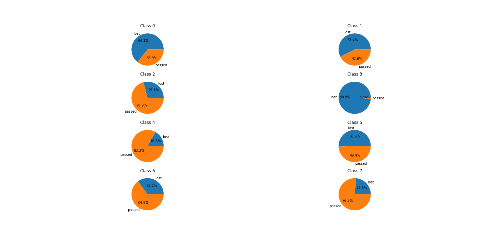
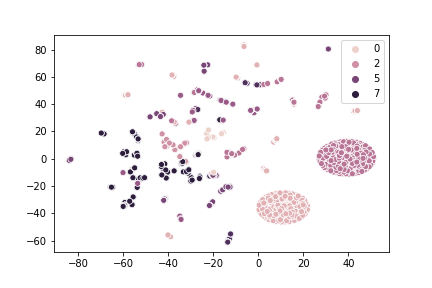

First steps
~~~~~~~~~~~

New experiment
==============

Before any analysis we should setup experiment with config.

Config describes how to create target events and its names,
name of index column e.g. `user_id`, name of event columns e.g. `event_name`
and name of event timestamp columns e.g. `event_timestamp`.

.. code:: python

    from retentioneering import init_config

    init_config(
        experiments_folder='experiments', # folder for saving experiment results: graph visualization, heatmaps and etc.
        index_col='user_pseudo_id', # column by which we split users / sessions / whatever
        event_col='event_name', # column that describes event
        event_time_col='event_timestamp', # column that describes timestamp of event
        positive_target_event='passed', # name of positive target event
        negative_target_event='lost', # name of negative target event
        pos_target_definition={ # how to define positive event, e.g. empty means that add passed for whom was not 'lost'
        },
        neg_target_definition={ # how to define negative event, e.g. users who were inactive for 600 seconds.
            'time_limit': 600
        },
    #     neg_target_definition={ # you also can define target event as list of other events
    #         'event_list': ['lost']
    #     }
    )

And also we need to read data and sort it by `event timestamp`, we will do it with `pandas`
due its convenience.

.. code:: python

    data = pd.read_csv('examples/data/train.csv')
    data = data.sort_values('event_timestamp')

Analysis
========

Graph visualization
-------------------

We can start analysis by whole graph visualization.

.. code:: python

    data.retention.plot_graph(thresh=0.05, width=800, height=800)

Output:

Step matrix
-----------

It may be hard to find something in whole graph visualization,
so data can be represented in more convenient way with step matrix.

.. code:: python

    desc_table = data.retention.get_step_matrix(max_steps=30)

Output:

Step matrix is good way for understanding main features of your app,
but it will be better to compare different groups of users to find insights
about why users get lost.

You can do it using following function.

.. code:: python

    # create group filter based on target events
    diff_filter = data.retention.create_filter()

    # calculate difference table between two groups
    diff_table = data.retention.get_step_matrix_difference(diff_filter, max_steps=30)

Output:

In the picture above we can see that lost users have problems
with different login types and policy acceptance.

Clustering
----------

Other way to create better graph visualization is to split users
into different clusters.

With clustering we can use different visualizations.

For example you can see target distributions in different clusters.

.. code:: python

    data.retention.get_clusters(plot_type='cluster_pie');

Output:

Or you can visualize it with TSNE plot

.. code:: python

    data.retention.get_clusters(plot_type='cluster_pie');

Output:

You can choose specific cluster and visualizes graph for it.

.. code:: python

    cluster5 = data.retention.filter_cluster(5)
    cluster5.retention.plot_graph(node_params, thresh=0.1, width=800, height=800)

Supervised classification
-------------------------

Firstly, model should be initialized.
You can do it as follows

.. code:: python

    model = data.retention.create_model()

And you can visualize importance of different edges on graph

.. code:: python

    features = data.retention.extract_features(ngram_range=(1,2))
    target = features.index.isin(data.retention.get_positive_users())
    model.permutation_importance(features, target, node_params)

